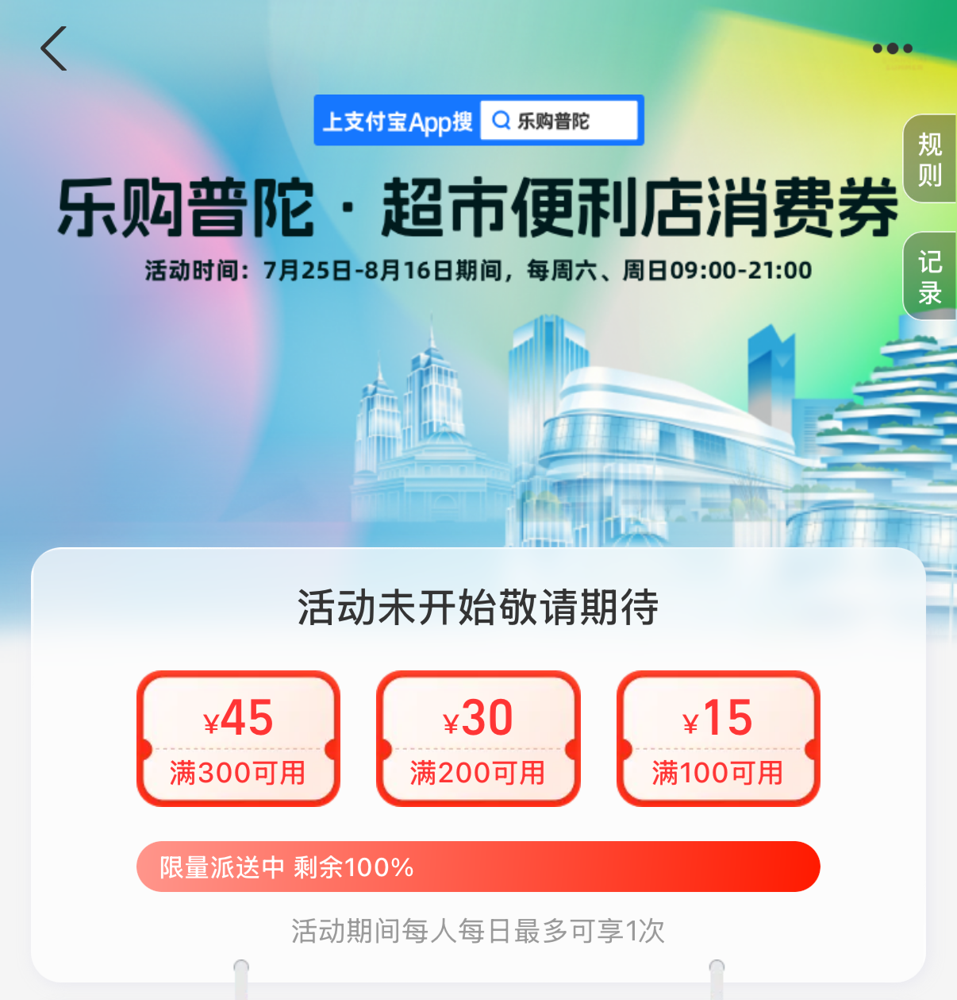
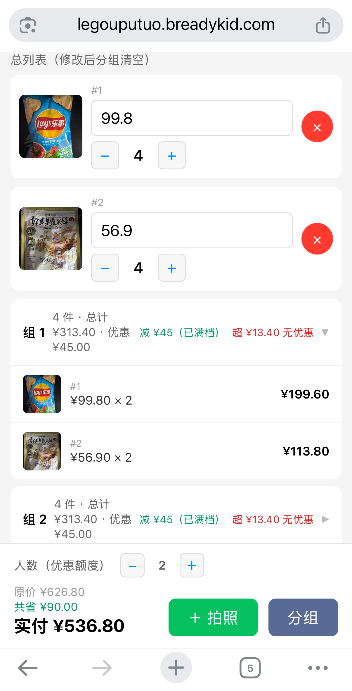

# 乐购普陀优惠计算器-离线用

> 几个人去买，自动划分商品凑满每人优惠额度，最大化省钱。



---

## 快速上手

浏览器打开 `https://legouputuo.breadykid.com`，手机 Chrome/Safari 均可。

```text
改人数  ──▶  +商品拍照  ──▶  填单价  ──▶  调数量  ──▶  点「分组」
```



## 优势

- 🔒 **隐私安全** — 拍照后图片留在浏览器内存（Blob URL），不传服务器、不落盘，关闭页面即消失
- 📴 **离线可用** — 页面加载一次后断网也能正常使用，拍照、算价、分组全在本地完成，针对山姆等信号不好的大卖场使用
- ⚡ **零依赖** — 单 HTML 静态页面，无需下载 App、注册登录、后端
- 🧮 **智能分组** — LPT 均摊算法自动拆分商品到每人额度，最大化满减优惠
- 📱 **全平台** — 手机 Chrome/Safari 直接打开，iOS/Android 通用

## 开发

- `index.html` — 单页应用，零外部依赖
- `test.js` — 分组算法单元测试，`node test.js` 运行
